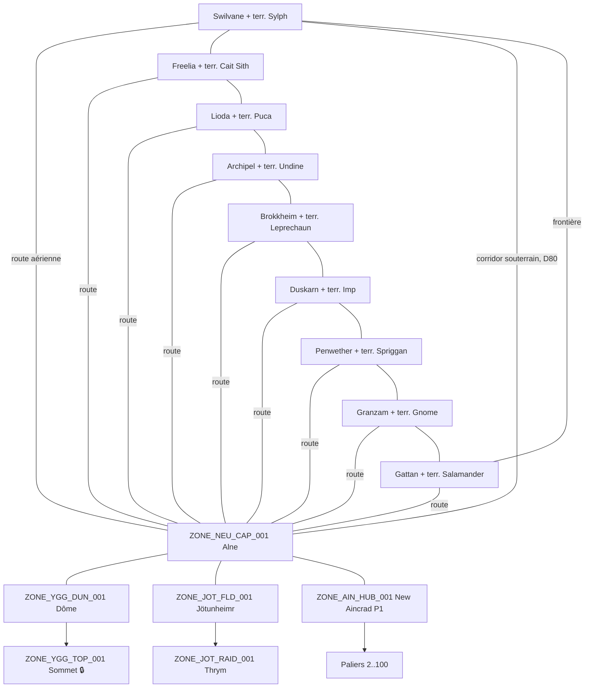

# 🗺️ ATLAS STRUCTUREL D'ALFHEIM — Découpage & Graphe de Liaisons des Zones

> **Statut** : Document-maître structurel (base). Les fiches détaillées par zone vivent dans
> `cartographie/territoires_raciaux/` et `cartographie/routes_aeriennes/` et DOIVENT référencer les ID définis ici.
> **Règle absolue (amendée D76, étape 48)** : 1 **territoire** = 1 groupe WhatsApp ; la zone reste la granularité
> du **gameplay** (adjacence, spawns, capacité), portée par l'état L1 `T_AVATARS.current_zone_id`
> (voir `the_seed_engine/system_mechanics/zone_movement_protocol.md` v2.0). L'ancienne règle « 1 zone = 1 groupe »
> est supersédée — contrainte réelle : ~100 groupes maximum par communauté WhatsApp.
> **Détail relationnel du graphe** : `cardinal_system_db/MLD_Logic/table_t_zone_links.md` (80 liaisons seed) ;
> registre des groupes : `table_t_wa_groups.md` ; registre des territoires : **§2-bis ci-dessous**.

---

## 1. Conventions d'Identifiants

| Élément | Format | Exemple |
|---|---|---|
| Zone | `ZONE_<SECTEUR>_<TYPE>_<NNN>` | `ZONE_SYL_CAP_001` |
| Route aérienne | `ZONE_ROUTE_<SECTEUR>_ALN` | `ZONE_ROUTE_SYL_ALN` |
| Palier New Aincrad | `ZONE_AIN_FLR_<NNN>` | `ZONE_AIN_FLR_027` |
| Territoire (D76) | slug minuscule (13 valeurs, §2-bis) | `sylphe`, `alne`, `jotunheimr` |
| Groupe WhatsApp (territoire) | `<emoji> Terres <Race>` / nom dédié pour l'axe neutre | `🌿 Terres Sylphes` |
| Groupe WhatsApp (instance) | `⚔️ RAID — <Donjon> #<n>` | `⚔️ RAID — Vent Hurlant #3` |

**Codes secteur** : `SYL` Sylph · `SAL` Salamander · `CAI` Cait Sith · `UND` Undine · `IMP` Imp · `GNO` Gnome · `PUC` Puca · `SPR` Spriggan · `LEP` Leprechaun · `NEU` Neutre (Alne) · `YGG` Yggdrasil · `JOT` Jötunheimr · `AIN` New Aincrad · `ROUTE` Couloir aérien.

**Codes type** : `CAP` capitale (safe) · `TWN` ville secondaire (safe) · `HUNT` zone de chasse (field, PvP) · `DUN` donjon · `RAID` zone de raid · `HUB` hub social · `FLD` zone sauvage spéciale · `FLR` palier · `TOP` sommet verrouillé.

---

## 2. Taxonomie des Groupes WhatsApp (amendée D76)

| Type (enum `T_WA_GROUPS.group_type`) | Porte | Exclusif ? | Quitté automatiquement ? | Exemples |
|---|---|---|---|---|
| `location` | un **TERRITOIRE** (13, §2-bis) | ✅ Oui — un joueur n'est que dans UN territoire | ✅ Oui, au franchissement de frontière de territoire (`sync_player_groups()`) | 🌿 Terres Sylphes, 🔥 Terres Salamanders |
| `dungeon_instance` | une instance éphémère | ✅ Oui (compte comme lieu) | ✅ Oui (fin de raid / mort / fuite) | ⚔️ RAID — Vent Hurlant #3 |
| `community_hub` | canal communautaire permanent | ❌ Non | ❌ **Jamais** (exception fondatrice) | 📢 Annonces, 📋 Enregistrement, 💬 Général, 🤝 LFG, 🏛️ les 9 groupes raciaux |
| `guild_hall` | une guilde | ❌ Non | ❌ Non (départ manuel / kick) | Groupes de guilde |
| `private_party` | une party | ❌ Non | ❌ Non (dissolution de groupe) | Groupes de party |
| `housing` | un logement (D-SOC) | ❌ Non | ❌ Non | Maisons de joueurs |
| `arena` | un événement PvP | ❌ Non | ✅ Oui (fin d'événement) | Tournois |
| `system` | canal Cardinal/GM | ❌ Non | ❌ Non | Support GM |

**Invariant Cardinal (R0 v2)** : pour tout avatar connecté, `card(groupes location ∪ dungeon_instance) = 1` —
la **zone** exacte est portée par `T_AVATARS.current_zone_id` (L1), jamais déduite des groupes.

*(Les anciens libellés v1 `LOCATION`/`INSTANCE`/`HUB_CHAT`/`GUILD`/`PARTY`/`SYSTEM` mappent respectivement sur
`location`/`dungeon_instance`/`community_hub`/`guild_hall`/`private_party`/`system` — l'enum du schéma implémenté fait foi.)*

---

## 2-bis. Registre Maître des Territoires (D76, étape 48) — source de vérité

13 territoires couvrent les 52 zones. La **zone d'ancrage** (première zone listée) est celle dont le `zone_id`
porte la ligne `T_WA_GROUPS` du territoire. Reflet implémenté : `TERRITORY_ZONES` (`bot/src/services/zone-groups.js`)
et `sync_player_groups()` (`schema.sql`) — toute modification passe d'abord ICI (règle L6).

| Territoire (slug) | Groupe WhatsApp | Zone d'ancrage | Zones couvertes |
|---|---|---|---|
| `sylphe` | 🌿 Terres Sylphes | `ZONE_SYL_CAP_001` | + `SYL_HUNT_001`, `SYL_HUNT_002`, `SYL_DUN_001`, `ROUTE_SYL_ALN` |
| `salamander` | 🔥 Terres Salamanders | `ZONE_SAL_CAP_001` | + `SAL_HUNT_001`, `SAL_HUNT_002`, `SAL_DUN_001`, `ROUTE_SAL_ALN`, `SAL_TWN_001` |
| `undine` | 💧 Terres Undines | `ZONE_UND_CAP_001` | + `UND_HUNT_001`, `UND_HUNT_002`, `UND_DUN_001`, `ROUTE_UND_ALN` |
| `cait` | 🐱 Terres Cait Sith | `ZONE_CAI_CAP_001` | + `CAI_HUNT_001`, `CAI_HUNT_002`, `CAI_DUN_001`, `ROUTE_CAI_ALN` |
| `gnome` | ⛰️ Terres Gnomes | `ZONE_GNO_CAP_001` | + `GNO_HUNT_001`, `GNO_HUNT_002`, `GNO_DUN_001`, `ROUTE_GNO_ALN` |
| `imp` | 🌑 Terres Imps | `ZONE_IMP_CAP_001` | + `IMP_HUNT_001`, `IMP_HUNT_002`, `IMP_DUN_001`, `ROUTE_IMP_ALN` |
| `leprechaun` | ⚒️ Terres Leprechauns | `ZONE_LEP_CAP_001` | + `LEP_HUNT_001`, `LEP_HUNT_002`, `LEP_DUN_001`, `ROUTE_LEP_ALN` |
| `puca` | 🎵 Terres Pucas | `ZONE_PUC_CAP_001` | + `PUC_HUNT_001`, `PUC_HUNT_002`, `PUC_DUN_001`, `ROUTE_PUC_ALN` |
| `spriggan` | 🌫️ Terres Spriggans | `ZONE_SPR_CAP_001` | + `SPR_HUNT_001`, `SPR_HUNT_002`, `SPR_DUN_001`, `ROUTE_SPR_ALN` |
| `alne` | 🏔️ Alne — Capitale Neutre | `ZONE_NEU_CAP_001` | (capitale seule) |
| `aincrad` | 🏰 New Aincrad | `ZONE_AIN_HUB_001` | paliers `AIN_FLR_002-100` = état L1 (D3 : palier de front éventuellement promu groupe dynamique) |
| `jotunheimr` | ❄️ Jötunheimr | `ZONE_JOT_FLD_001` | + `JOT_RAID_001` |
| `yggdrasil` | 🌳 Yggdrasil | `ZONE_YGG_DUN_001` | + `YGG_TOP_001` |

**Budget communautaire WhatsApp (~100 groupes max)** :

| Couche | Groupes | Type |
|---|---|---|
| Communauté (Annonces, Enregistrement, Général, LFG) | 4 | `community_hub` |
| Raciaux (🏛️ un par peuple, jamais quittés) | 9 | `community_hub` |
| Territoires (auto-switch au déplacement) | 13 | `location` |
| **Total permanent** | **26** | — |
| Slots dynamiques restants (instances, guildes, parties, housing, arène) | **~74** | éphémères/sociaux |

---

## 3. Disposition Radiale d'Alfheim (Plan Horizontal)

Alfheim est un disque centré sur **Yggdrasil / Alne**. Les 9 territoires raciaux forment un anneau.
Ordre horaire (départ Sud) : **Salamander → Sylph → Cait Sith → Puca → Undine → Leprechaun → Imp → Spriggan → Gnome → (retour Salamander)**.

**Frontières terrestres** (paires de zones `HUNT_002` connectées) :

| Frontière | Liaison | Statut lore |
|---|---|---|
| Salamander ↔ Sylph | `ZONE_SAL_HUNT_002` ↔ `ZONE_SYL_HUNT_002` | Tension historique (Siège de Swilvane) |
| Sylph ↔ Cait Sith | `ZONE_SYL_HUNT_002` ↔ `ZONE_CAI_HUNT_002` | Alliance (Sakuya – Alicia Rue) |
| Cait Sith ↔ Puca | `ZONE_CAI_HUNT_002` ↔ `ZONE_PUC_HUNT_002` | Neutre commerçante |
| Puca ↔ Undine | `ZONE_PUC_HUNT_002` ↔ `ZONE_UND_HUNT_002` | Cordiale |
| Undine ↔ Leprechaun | `ZONE_UND_HUNT_002` ↔ `ZONE_LEP_HUNT_002` | Commerce (eau/forge) |
| Leprechaun ↔ Imp | `ZONE_LEP_HUNT_002` ↔ `ZONE_IMP_HUNT_002` | Concurrence minière |
| Imp ↔ Spriggan | `ZONE_IMP_HUNT_002` ↔ `ZONE_SPR_HUNT_002` | Pacte des Ombres |
| Spriggan ↔ Gnome | `ZONE_SPR_HUNT_002` ↔ `ZONE_GNO_HUNT_002` | Froide |
| Gnome ↔ Salamander | `ZONE_GNO_HUNT_002` ↔ `ZONE_SAL_HUNT_002` | Escarmouches frontalières |

---

## 4. Registre Maître des Zones

### 4.1 Patron structurel par territoire racial

Chaque territoire suit le même gabarit (5 zones minimum) :

```
CAP (capitale, safe) ── HUNT_001 (chasse intérieure)
   │                        │
   ├── HUNT_002 (chasse frontalière) ── HUNT_002 voisin(s)
   │        │
   │      DUN_001 (donjon territorial)
   └── ROUTE_<SEC>_ALN (couloir aérien) ── ALNE
```

### 4.2 Territoire Sylph (SO) — *fiches existantes ✅*

| ID | Nom | Type | Tier | Safe | Liaisons (`connected_zones`) |
|---|---|---|---|---|---|
| `ZONE_SYL_CAP_001` | Swilvane | CAP | 1 | ✅ | `SYL_HUNT_001`, `SYL_HUNT_002`, `SYL_DUN_001`, `ROUTE_SYL_ALN` |
| `ZONE_SYL_HUNT_001` | Prairies de Sylvain | HUNT | 1 | ❌ | `SYL_CAP_001`, `SYL_HUNT_002` |
| `ZONE_SYL_HUNT_002` | Forêt de Lugru | HUNT | 3 | ❌ | `SYL_CAP_001`, `SYL_HUNT_001`, `SYL_DUN_001`, `CAI_HUNT_002`, `SAL_HUNT_002`, `ROUTE_LUGRU` |
| `ZONE_SYL_DUN_001` | Donjon du Vent Hurlant | DUN | 4 | ❌ | `SYL_CAP_001`, `SYL_HUNT_002` |
| `ZONE_ROUTE_SYL_ALN` | Route Aérienne Swilvane–Alne | ROUTE | 2 | ❌ | `SYL_CAP_001`, `NEU_CAP_001` |
| `ZONE_ROUTE_LUGRU` | Corridor Souterrain de Lugru | ROUTE | 3 | ❌ | `SYL_HUNT_002`, `NEU_CAP_001` — raccourci direct Forêt de Lugru ↔ Alne (D80), `link_type=UNDERGROUND` (à pied, pas de vol requis) |

### 4.3 Territoire Salamander (S) — *fiches existantes ✅ complet (donjon + route : étape 3)*

| ID | Nom | Type | Tier | Safe | Liaisons |
|---|---|---|---|---|---|
| `ZONE_SAL_CAP_001` | Gattan | CAP | 1 | ✅ | `SAL_TWN_001`, `SAL_HUNT_001`, `SAL_HUNT_002`, `SAL_DUN_001`, `ROUTE_SAL_ALN` |
| `ZONE_SAL_TWN_001` | Voulg (forteresse militaire) | TWN | 2 | ✅ | `SAL_CAP_001`, `SAL_HUNT_001` |
| `ZONE_SAL_HUNT_001` | Plaines de Cendres | HUNT | 1 | ❌ | `SAL_CAP_001`, `SAL_TWN_001`, `SAL_HUNT_002` |
| `ZONE_SAL_HUNT_002` | Désolation de Magma | HUNT | 3 | ❌ | `SAL_CAP_001`, `SAL_HUNT_001`, `SAL_DUN_001`, `SYL_HUNT_002`, `GNO_HUNT_002` |
| `ZONE_SAL_DUN_001` | Caldeira d'Obsidienne | DUN | 4 | ❌ | `SAL_CAP_001`, `SAL_HUNT_002` |
| `ZONE_ROUTE_SAL_ALN` | Route Aérienne Gattan–Alne | ROUTE | 2 | ❌ | `SAL_CAP_001`, `NEU_CAP_001` |

> ⚠️ **Arbitrage structurel** : la capitale Salamander est **Gattan** (`ZONE_SAL_CAP_001`).
> **Voulg** (`lore_mecaniques/geographie_villes/voulg_territoire_salamander.md`) est requalifiée
> ville-forteresse secondaire `ZONE_SAL_TWN_001` ; ses PNJ (`NPC_VOU_*`) restent valides.

### 4.4 Territoire Cait Sith (O) — *fiches existantes ✅ (étape 2)*

| ID | Nom | Type | Tier | Safe | Liaisons |
|---|---|---|---|---|---|
| `ZONE_CAI_CAP_001` | Freelia | CAP | 1 | ✅ | `CAI_HUNT_001`, `CAI_HUNT_002`, `CAI_DUN_001`, `ROUTE_CAI_ALN` |
| `ZONE_CAI_HUNT_001` | Savane des Crocs | HUNT | 1 | ❌ | `CAI_CAP_001`, `CAI_HUNT_002` |
| `ZONE_CAI_HUNT_002` | Collines de l'Ouest | HUNT | 3 | ❌ | `CAI_CAP_001`, `CAI_HUNT_001`, `CAI_DUN_001`, `SYL_HUNT_002`, `PUC_HUNT_002` |
| `ZONE_CAI_DUN_001` | Tanière du Roi Béhémoth | DUN | 4 | ❌ | `CAI_CAP_001`, `CAI_HUNT_002` |
| `ZONE_ROUTE_CAI_ALN` | Route Aérienne Freelia–Alne | ROUTE | 2 | ❌ | `CAI_CAP_001`, `NEU_CAP_001` |

### 4.5 Territoire Puca (NO) — *fiches existantes ✅ (étape 2)*

| ID | Nom | Type | Tier | Safe | Liaisons |
|---|---|---|---|---|---|
| `ZONE_PUC_CAP_001` | Lioda | CAP | 1 | ✅ | `PUC_HUNT_001`, `PUC_HUNT_002`, `PUC_DUN_001`, `ROUTE_PUC_ALN` |
| `ZONE_PUC_HUNT_001` | Prairies Chantantes | HUNT | 1 | ❌ | `PUC_CAP_001`, `PUC_HUNT_002` |
| `ZONE_PUC_HUNT_002` | Bois des Échos | HUNT | 3 | ❌ | `PUC_CAP_001`, `PUC_HUNT_001`, `PUC_DUN_001`, `CAI_HUNT_002`, `UND_HUNT_002` |
| `ZONE_PUC_DUN_001` | Amphithéâtre Oublié | DUN | 4 | ❌ | `PUC_CAP_001`, `PUC_HUNT_002` |
| `ZONE_ROUTE_PUC_ALN` | Route Aérienne Lioda–Alne | ROUTE | 2 | ❌ | `PUC_CAP_001`, `NEU_CAP_001` |

### 4.6 Territoire Undine (N) — *fiches existantes ✅ complet (étape 3 ; CAP = fiche lore `geographie_villes`)*

| ID | Nom | Type | Tier | Safe | Liaisons |
|---|---|---|---|---|---|
| `ZONE_UND_CAP_001` | Archipel d'Écume | CAP | 1 | ✅ | `UND_HUNT_001`, `UND_HUNT_002`, `UND_DUN_001`, `ROUTE_UND_ALN` |
| `ZONE_UND_HUNT_001` | Lac Cristallin | HUNT | 1 | ❌ | `UND_CAP_001`, `UND_HUNT_002` |
| `ZONE_UND_HUNT_002` | Marais de Brume | HUNT | 3 | ❌ | `UND_CAP_001`, `UND_HUNT_001`, `UND_DUN_001`, `PUC_HUNT_002`, `LEP_HUNT_002` |
| `ZONE_UND_DUN_001` | Gouffre de Léviathan | DUN | 5 | ❌ | `UND_CAP_001`, `UND_HUNT_002` — *sous-marin : magie de respiration requise* |
| `ZONE_ROUTE_UND_ALN` | Route Aérienne Archipel–Alne | ROUTE | 2 | ❌ | `UND_CAP_001`, `NEU_CAP_001` |

### 4.7 Territoire Leprechaun (NE) — *fiches existantes ✅ (étape 2)*

| ID | Nom | Type | Tier | Safe | Liaisons |
|---|---|---|---|---|---|
| `ZONE_LEP_CAP_001` | Brokkheim | CAP | 1 | ✅ | `LEP_HUNT_001`, `LEP_HUNT_002`, `LEP_DUN_001`, `ROUTE_LEP_ALN` |
| `ZONE_LEP_HUNT_001` | Vallée des Geysers | HUNT | 1 | ❌ | `LEP_CAP_001`, `LEP_HUNT_002` |
| `ZONE_LEP_HUNT_002` | Champs de Scories | HUNT | 3 | ❌ | `LEP_CAP_001`, `LEP_HUNT_001`, `LEP_DUN_001`, `UND_HUNT_002`, `IMP_HUNT_002` |
| `ZONE_LEP_DUN_001` | Atelier Englouti | DUN | 4 | ❌ | `LEP_CAP_001`, `LEP_HUNT_002` |
| `ZONE_ROUTE_LEP_ALN` | Route Aérienne Brokkheim–Alne | ROUTE | 2 | ❌ | `LEP_CAP_001`, `NEU_CAP_001` |

### 4.8 Territoire Imp (E) — *fiches existantes ✅ (étape 2)*

| ID | Nom | Type | Tier | Safe | Liaisons |
|---|---|---|---|---|---|
| `ZONE_IMP_CAP_001` | Duskarn | CAP | 1 | ✅ | `IMP_HUNT_001`, `IMP_HUNT_002`, `IMP_DUN_001`, `ROUTE_IMP_ALN` |
| `ZONE_IMP_HUNT_001` | Canyon des Ombres | HUNT | 1 | ❌ | `IMP_CAP_001`, `IMP_HUNT_002` |
| `ZONE_IMP_HUNT_002` | Falaises du Crépuscule | HUNT | 3 | ❌ | `IMP_CAP_001`, `IMP_HUNT_001`, `IMP_DUN_001`, `LEP_HUNT_002`, `SPR_HUNT_002` |
| `ZONE_IMP_DUN_001` | Caverne des Hurleurs | DUN | 4 | ❌ | `IMP_CAP_001`, `IMP_HUNT_002` |
| `ZONE_ROUTE_IMP_ALN` | Route Aérienne Duskarn–Alne | ROUTE | 2 | ❌ | `IMP_CAP_001`, `NEU_CAP_001` |

### 4.9 Territoire Spriggan (SE) — *fiches existantes ✅ (étape 2)*

| ID | Nom | Type | Tier | Safe | Liaisons |
|---|---|---|---|---|---|
| `ZONE_SPR_CAP_001` | Penwether | CAP | 1 | ✅ | `SPR_HUNT_001`, `SPR_HUNT_002`, `SPR_DUN_001`, `ROUTE_SPR_ALN` |
| `ZONE_SPR_HUNT_001` | Ruines Noires | HUNT | 1 | ❌ | `SPR_CAP_001`, `SPR_HUNT_002` |
| `ZONE_SPR_HUNT_002` | Terres Grises | HUNT | 3 | ❌ | `SPR_CAP_001`, `SPR_HUNT_001`, `SPR_DUN_001`, `IMP_HUNT_002`, `GNO_HUNT_002` |
| `ZONE_SPR_DUN_001` | Nécropole Antique | DUN | 4 | ❌ | `SPR_CAP_001`, `SPR_HUNT_002` |
| `ZONE_ROUTE_SPR_ALN` | Route Aérienne Penwether–Alne | ROUTE | 2 | ❌ | `SPR_CAP_001`, `NEU_CAP_001` |

### 4.10 Territoire Gnome (S-SE) — *fiches existantes ✅ (étape 2)*

| ID | Nom | Type | Tier | Safe | Liaisons |
|---|---|---|---|---|---|
| `ZONE_GNO_CAP_001` | Granzam | CAP | 1 | ✅ | `GNO_HUNT_001`, `GNO_HUNT_002`, `GNO_DUN_001`, `ROUTE_GNO_ALN` |
| `ZONE_GNO_HUNT_001` | Steppes de Granit | HUNT | 1 | ❌ | `GNO_CAP_001`, `GNO_HUNT_002` |
| `ZONE_GNO_HUNT_002` | Carrières Brisées | HUNT | 3 | ❌ | `GNO_CAP_001`, `GNO_HUNT_001`, `GNO_DUN_001`, `SPR_HUNT_002`, `SAL_HUNT_002` |
| `ZONE_GNO_DUN_001` | Mine de Mithril Abandonnée | DUN | 4 | ❌ | `GNO_CAP_001`, `GNO_HUNT_002` |
| `ZONE_ROUTE_GNO_ALN` | Route Aérienne Granzam–Alne | ROUTE | 2 | ❌ | `GNO_CAP_001`, `NEU_CAP_001` |

### 4.11 Axe Central & Vertical (Neutre)

| ID | Nom | Type | Tier | Safe | Liaisons | Condition d'accès |
|---|---|---|---|---|---|---|
| `ZONE_NEU_CAP_001` | Alne (capitale neutre) | CAP | 1 | ✅ | Les 9 `ROUTE_*_ALN`, `ROUTE_LUGRU` (D80, raccourci souterrain), `YGG_DUN_001`, `JOT_FLD_001`, `AIN_HUB_001` | Libre |
| `ZONE_YGG_DUN_001` | Dôme d'Yggdrasil | RAID | 8 | ❌ | `NEU_CAP_001`, `YGG_TOP_001` | Grand Quest (raid multi-guildes) — boss `BOSS_YGG_001` Le Gardien du Dôme |
| `ZONE_YGG_TOP_001` | Sommet d'Yggdrasil | TOP | 10 | ✅ | `YGG_DUN_001` | 🔒 Verrouillé — victoire de la Grand Quest |
| `ZONE_JOT_FLD_001` | Abysse de Jötunheimr | FLD | 7 | ❌ | `NEU_CAP_001` (crevasse sous Alne), `JOT_RAID_001` | Item-clé « Clé de Glace » — **vol impossible** |
| `ZONE_JOT_RAID_001` | Trône de Thrym | RAID | 9 | ❌ | `JOT_FLD_001` | Boss : Thrym (cf. `personnages_bestiaire/monstres/thrym_roi_des_geants.md`) |
| `ZONE_AIN_HUB_001` | New Aincrad — Palier 1 (Ville du Début) | HUB | 1 | ✅ | `NEU_CAP_001` (vol), `AIN_FLR_002` | Vol requis |
| `ZONE_AIN_FLR_002` → `ZONE_AIN_FLR_100` | New Aincrad — Paliers 2 à 100 | FLR | 1→10 | ❌ | Palier N ↔ N±1 (progression linéaire) | Boss du palier N−1 vaincu — `BOSS_AIN_<NNN>` (cf. `personnages_bestiaire/_index_boss_axe_vertical.md`) |

> **New Aincrad — règle structurelle (harmonisée D76)** : les paliers ne sont PAS 100 groupes WhatsApp permanents.
> Le territoire `aincrad` (§2-bis) porte le groupe permanent (ancré au Palier 1) ; la position exacte d'un joueur
> dans les paliers 2-100 est de l'état L1 (`current_zone_id`). Le **palier de front** (plus haut palier atteint par
> le serveur) peut être promu groupe dynamique sur le budget de slots libres ; les salles de boss sont des groupes
> `dungeon_instance` éphémères créés via `!dungeon_queue`.
> Boss : **nommés/canon** = fiches `BOSS_AIN_001/027/074/075/100` ; **paliers génériques** = profil paramétrique
> (fonction du n° de palier) instancié à la volée — pas de fiche permanente (cf. index d'axe vertical §3).

---

## 5. Graphe Global (Vue Synthétique)



---

## 6. Règles Structurelles de Liaison (Contraintes d'Intégrité)

| # | Règle | Application |
|---|---|---|
| L1 | Le graphe de voisinage est **symétrique** : si A liste B, B liste A. | Validation à l'insertion dans `T_ZONES.connected_zones` |
| L2 | Toute capitale est reliée à Alne par exactement **une** route aérienne. | 9 routes `ZONE_ROUTE_*_ALN` |
| L3 | Un déplacement n'est valide que vers une zone **adjacente** (sauf téléportation/`!portal`/`!fast_travel`). | Protocole de déplacement §R3 |
| L4 | Une zone `DUN`/`RAID` n'est jamais adjacente à plus de 2 zones. | Contrôle de profondeur |
| L5 | Les routes aériennes exigent `requires_flight = TRUE` ; Jötunheimr force `flight = OFF`. | Moteur de vol |
| L6 | Toute nouvelle zone DOIT être ajoutée à ce registre AVANT création de sa fiche détaillée et de son groupe WhatsApp. | Workflow de contenu |

---

## 7. Équivalents Commandes (obligatoires pour toute manipulation de l'atlas)

| Opération structurelle | Commande Joueur | Commande GM | Commande IA (Function Calling) |
|---|---|---|---|
| Consulter zones adjacentes | `!map` (Navigation Lv.2+) | — | `SYS_REVEAL_MAP(Avatar_ID, Zone_ID)` |
| Connaître sa position | `!where` | — | — |
| Se déplacer (adjacence) | `!enter_zone [Zone]` (alias `!marcher`, `!voler`) | `!sys_group_add` / `!sys_group_kick` | `SYS_FORCE_TELEPORT(Avatar_ID, Zone_ID)` |
| Créer une liaison entre zones | — | `!sys_zone_link [Zone_A] [Zone_B]` | `SYS_CONNECT_ZONES(Zone_A, Zone_B)` |
| Supprimer une liaison | — | `!sys_zone_unlink [Zone_A] [Zone_B]` | `SYS_DISCONNECT_ZONES(Zone_A, Zone_B)` |
| Verrouiller une zone | — | `!sys_zone_lock [Zone_ID]` | `SYS_LOCK_ZONE(Zone_ID, Raison)` |
| Créer une zone (+ groupe WA) | — | `!sys_group_create [Nom] [Type]` | `SYS_REBUILD_TOWN(Town_ID)` |
| Reconfigurer un labyrinthe | — | — | `SYS_CREATE_MAZE(Zone_ID, Complexity)` |
